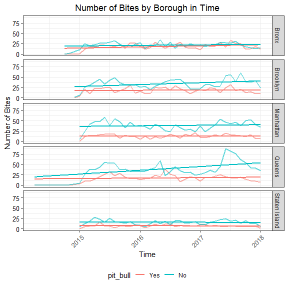

Dog Bite Time Viz & Modeling
================
Quinton Neville
December 3rd, 2018

Read in Data
============

``` r
#dog.bite.df <- read_csv("./data/dog_bite.csv")

#Read and clean data
## Dog Bite data

queens <- c("astoria", "elmhurst", "flushing", "jackson heights", "kew gardens", "woodside", "briarwood", "corona", "forest hills", "ozone park", "richmond hill", "rockaway park", "arverne", "bayside", "belle harbor", "cambria heights", "college point", "east elmhurst", "glen oaks", "glendale", "jackson hgts", "long island city", "maspeth", "middle vilg", "middle village", "oakland gardens", "quens", "ridgewood", "so richmond", "south richmond hil", "woodside ny.", "fresh meadows", 'queens village')

not_nyc <- c("jersey city", "albany", "bronxville", "floral park", "hoboken", "kissimmee florida", "lynbrook", "middletown", "san francisco", "santa monica", "wappingers falls, ny", "west palm beach", "the villages")

staten_island <- c("staten is", "staten island, ny", "staten island")

unknown_borough <- c("new york", "new york city", "nyc", "ny", "b", "potomac", NA)


# get list of real zipcodes for each borough
data(zipcode) 
zipcode = zipcode %>%
  mutate(city = tolower(city),
         borough = ifelse(city %in% c('new york', 'manhattan'), 'Manhattan', NA),
         borough = ifelse(city == 'bronx', 'Bronx', borough),
         borough = ifelse(city == 'brooklyn', 'Brooklyn', borough),
         borough = ifelse(city %in% c('queens', queens), 'Queens', borough),
         borough = ifelse(city %in% c('staten island', staten_island), 'Staten Island', borough)) %>%
  filter(borough %in% c('Manhattan', 'Bronx', 'Brooklyn', 'Queens', 'Staten Island') & state == 'NY')

zip_list = zipcode %>%
  select(borough, zip) %>%
  nest(-borough)
```

``` r
# list of official NYC zip codes 
official.zip = paste(zipcode$zip, collapse = '|')

# dog bite data
dog_bite = read_csv('./data/DOHMH_Dog_Bite_Data.csv',
                    col_type = cols(UniqueID = col_integer(),
                        DateOfBite = col_date(format = '%B %d %Y'), # set as date variable
                        Species = col_character(),
                        Breed = col_character(),
                        Age = col_number(),
                        Gender = col_character(),
                        SpayNeuter = col_logical(),
                        Borough = col_character(),
                        ZipCode = col_character()
                      )) %>% # read data
  janitor::clean_names() %>%
  mutate(pit_bull = str_detect(tolower(breed), 'pit bull|pitbull|pit-bull')) %>% # logical column for whether dog was a pitbull breed or not
  mutate(
    zip_code = zip_code %>% 
               ifelse(str_length(.) != 5, NA, .) %>%  # set zip codes without length 5 equal to NA
               str_replace(., "O", "0") %>% # replace O's with zeros
               ifelse(str_detect(., "^[02-9]"), NA, .), # ?
    zip_match = str_detect(zip_code, official.zip), # is the given zip code valid?
    zip_code  = ifelse(zip_match == FALSE, NA, zip_code)
  ) %>%
  left_join(.,
            na.omit(.) %>% 
            left_join(., count(., borough), by = "borough") %>% 
            group_by(borough, zip_code) %>%
            summarize(proportion = n()/unique(n)) %>% 
            rename(zip_list = zip_code) %>%
            nest(zip_list, proportion) %>% 
            rename(zip_nest = data),
            by = 'borough') %>% 
  mutate(
    zip_sample = map_chr(.x = zip_nest, ~sample(.x$zip_list, 1, prob = .x$proportion)),
    zip_code_imputed = zip_code %>% ifelse(is.na(.), zip_sample, .)
  ) %>% 
  select(-c(zip_nest, zip_sample))

# write.csv(dog_bite, './data/dog_bite.csv', row.names = F)
```

Visualization
=============

``` r
 time.overall.df <- dog_bite %>%
  mutate(date = ymd(date_of_bite)) %>% 
  mutate_at(vars(date), funs(year, month, day)) %>%
  mutate(date_numeric = lubridate::decimal_date(date)) %>%
  select(-date) %>% 
  mutate(borough = as.factor(borough)) %>% 
  group_by(year, month) %>%
  summarise(
    pitbull    = sum(pit_bull),
    no_pitbull = sum(!(pit_bull))
  ) %>% ungroup() %>%
  gather(key = pit_bull, value = num_bites, pitbull:no_pitbull) %>%
  mutate(
    pit_bull = ifelse(pit_bull == "pitbull", "Yes", "No") %>% as.factor(),
    pit_bull = fct_relevel(pit_bull, "Yes"),
    date_numeric = year + (month - 1)/12
  )


time.overall.plot <- time.overall.df %>%
 ggplot(aes(x = date_numeric, y = num_bites, colour = pit_bull)) + 
  geom_point(alpha = 0.7, size = 2) + 
  geom_line(size = 1) + 
  geom_smooth(aes(colour = pit_bull), alpha = 0.5, se = F, method = "lm") + 
    theme(legend.position = "bottom",
        axis.text.y = element_text(color = "black", 
                                   size = 10,  hjust = 1), 
        axis.text.x = element_text(angle = 45, 
                                   hjust = 1, size = 10)) +
  labs(
    x = "Time",
    y = "Number of Bites",
    title = "Number of Bites by Borough in Time"
  ) #+ xlim(c(2015, 2018)) +
```

``` r
time.boro.df <- dog_bite %>%
  mutate(date = ymd(date_of_bite)) %>% 
  mutate_at(vars(date), funs(year, month, day)) %>%
  mutate(date_numeric = lubridate::decimal_date(date)) %>%
  select(-date) %>% 
  mutate(
    borough = as.factor(borough)
  ) %>% group_by(year, month, borough) %>%
  summarise(
    pitbull    = sum(pit_bull),
    no_pitbull = sum(!(pit_bull))
  ) %>% ungroup() %>%
  gather(key = pit_bull, value = num_bites, pitbull:no_pitbull) %>%
  mutate(
    pit_bull = ifelse(pit_bull == "pitbull", "Yes", "No") %>% as.factor(),
    pit_bull = fct_relevel(pit_bull, "Yes"),
    date_numeric = year + (month - 1)/12
  )

time.boro.plot <- time.boro.df %>%
  filter(borough != "Other") %>%
  ggplot(aes(x = date_numeric, y = num_bites, colour = pit_bull)) + 
 # geom_point(alpha = 0.3, size = 2) + 
  geom_line(size = 1, alpha = 0.6) + 
  geom_smooth(aes(colour = pit_bull), alpha = 0.3, se = F, method = "lm") + 
  theme(legend.position = "bottom",
        axis.text.y = element_text(color = "black", 
                                   size = 10,  hjust = 1), 
        axis.text.x = element_text(angle = 45, 
                                   hjust = 1, size = 10)) +
  labs(
    x = "Time",
    y = "Number of Bites",
    title = "Number of Bites by Borough in Time"
  ) + 
#  xlim(c(2015, 2018)) +
  facet_grid(borough~.)


time.overall.plot
```


``` r
time.boro.plot
```



Logistic Model in Time
======================

``` r
#Modeling with grouped data
time.boro.df <- time.boro.df %>%
  mutate(date_numeric = date_numeric - 2015)

#Initial Model with Just time
logit.1 <- glm(pit_bull ~ date_numeric + num_bites, family = "binomial", data = time.boro.df)
summary(logit.1)
```

    ## 
    ## Call:
    ## glm(formula = pit_bull ~ date_numeric + num_bites, family = "binomial", 
    ##     data = time.boro.df)
    ## 
    ## Deviance Residuals: 
    ##     Min       1Q   Median       3Q      Max  
    ## -2.0083  -0.9484  -0.2415   0.9421   1.9047  
    ## 
    ## Coefficients:
    ##              Estimate Std. Error z value             Pr(>|z|)    
    ## (Intercept)  -1.42472    0.25227  -5.648         0.0000000163 ***
    ## date_numeric -0.12997    0.11856  -1.096                0.273    
    ## num_bites     0.08930    0.01008   8.857 < 0.0000000000000002 ***
    ## ---
    ## Signif. codes:  0 '***' 0.001 '**' 0.01 '*' 0.05 '.' 0.1 ' ' 1
    ## 
    ## (Dispersion parameter for binomial family taken to be 1)
    ## 
    ##     Null deviance: 632.15  on 455  degrees of freedom
    ## Residual deviance: 517.08  on 453  degrees of freedom
    ## AIC: 523.08
    ## 
    ## Number of Fisher Scoring iterations: 4

``` r
#Add Borough
logit.2 <- glm(pit_bull ~ date_numeric + num_bites + borough, family = "binomial", data = time.boro.df)
summary(logit.2)
```

    ## 
    ## Call:
    ## glm(formula = pit_bull ~ date_numeric + num_bites + borough, 
    ##     family = "binomial", data = time.boro.df)
    ## 
    ## Deviance Residuals: 
    ##      Min        1Q    Median        3Q       Max  
    ## -2.32611  -0.78835  -0.05624   0.69831   3.12816  
    ## 
    ## Coefficients:
    ##                      Estimate Std. Error z value             Pr(>|z|)    
    ## (Intercept)          -3.71439    0.52420  -7.086     0.00000000000138 ***
    ## date_numeric         -0.21529    0.14094  -1.528               0.1266    
    ## num_bites             0.20482    0.02077   9.863 < 0.0000000000000002 ***
    ## boroughBrooklyn      -1.08622    0.42700  -2.544               0.0110 *  
    ## boroughManhattan     -0.68748    0.46844  -1.468               0.1422    
    ## boroughOther          3.17854    0.49349   6.441     0.00000000011872 ***
    ## boroughQueens        -1.33223    0.45622  -2.920               0.0035 ** 
    ## boroughStaten Island  1.76937    0.42654   4.148     0.00003350756569 ***
    ## ---
    ## Signif. codes:  0 '***' 0.001 '**' 0.01 '*' 0.05 '.' 0.1 ' ' 1
    ## 
    ## (Dispersion parameter for binomial family taken to be 1)
    ## 
    ##     Null deviance: 632.15  on 455  degrees of freedom
    ## Residual deviance: 418.76  on 448  degrees of freedom
    ## AIC: 434.76
    ## 
    ## Number of Fisher Scoring iterations: 6

``` r
#Modeling with original data
 logit.df <- dog_bite %>%
  mutate(date = ymd(date_of_bite)) %>% 
  mutate_at(vars(date), funs(year, month, day)) %>%
  mutate(date_numeric = lubridate::decimal_date(date)) %>%
  select(-date) %>% 
  mutate(borough = as.factor(borough),
         date_numeric = date_numeric - 2015) %>%
   select(pit_bull, gender, spay_neuter, borough, zip_code_imputed, year, month, day, date_numeric)
 
 #Inital Model in Time
 logit.full.1 <- glm(pit_bull ~ date_numeric, family = "binomial", data = logit.df)
 summary(logit.full.1)
```

    ## 
    ## Call:
    ## glm(formula = pit_bull ~ date_numeric, family = "binomial", data = logit.df)
    ## 
    ## Deviance Residuals: 
    ##     Min       1Q   Median       3Q      Max  
    ## -0.9304  -0.8975  -0.8668   1.4731   1.5433  
    ## 
    ## Coefficients:
    ##              Estimate Std. Error z value            Pr(>|z|)    
    ## (Intercept)  -0.62306    0.04644 -13.417 <0.0000000000000002 ***
    ## date_numeric -0.06700    0.02604  -2.573              0.0101 *  
    ## ---
    ## Signif. codes:  0 '***' 0.001 '**' 0.01 '*' 0.05 '.' 0.1 ' ' 1
    ## 
    ## (Dispersion parameter for binomial family taken to be 1)
    ## 
    ##     Null deviance: 10990  on 8706  degrees of freedom
    ## Residual deviance: 10983  on 8705  degrees of freedom
    ## AIC: 10987
    ## 
    ## Number of Fisher Scoring iterations: 4

``` r
 #Add Borough effect
 logit.full.2 <- glm(pit_bull ~ date_numeric + borough, family = "binomial", data = logit.df)
 summary(logit.full.2)
```

    ## 
    ## Call:
    ## glm(formula = pit_bull ~ date_numeric + borough, family = "binomial", 
    ##     data = logit.df)
    ## 
    ## Deviance Residuals: 
    ##     Min       1Q   Median       3Q      Max  
    ## -1.1560  -0.8895  -0.7844   1.2854   1.8682  
    ## 
    ## Coefficients:
    ##                      Estimate Std. Error z value             Pr(>|z|)    
    ## (Intercept)          -0.06040    0.06577  -0.918               0.3584    
    ## date_numeric         -0.06604    0.02642  -2.500               0.0124 *  
    ## boroughBrooklyn      -0.46409    0.07028  -6.603     0.00000000004019 ***
    ## boroughManhattan     -0.93429    0.07424 -12.584 < 0.0000000000000002 ***
    ## boroughOther         -1.29546    0.15024  -8.623 < 0.0000000000000002 ***
    ## boroughQueens        -0.66119    0.06943  -9.523 < 0.0000000000000002 ***
    ## boroughStaten Island -0.62874    0.09048  -6.949     0.00000000000367 ***
    ## ---
    ## Signif. codes:  0 '***' 0.001 '**' 0.01 '*' 0.05 '.' 0.1 ' ' 1
    ## 
    ## (Dispersion parameter for binomial family taken to be 1)
    ## 
    ##     Null deviance: 10990  on 8706  degrees of freedom
    ## Residual deviance: 10776  on 8700  degrees of freedom
    ## AIC: 10790
    ## 
    ## Number of Fisher Scoring iterations: 4

``` r
 #Check Effect Modifier
 logit.full.3 <- glm(pit_bull ~ date_numeric + borough + borough:date_numeric, family = "binomial", data = logit.df)
 summary(logit.full.3)
```

    ## 
    ## Call:
    ## glm(formula = pit_bull ~ date_numeric + borough + borough:date_numeric, 
    ##     family = "binomial", data = logit.df)
    ## 
    ## Deviance Residuals: 
    ##     Min       1Q   Median       3Q      Max  
    ## -1.1795  -0.8928  -0.7615   1.3078   1.9609  
    ## 
    ## Coefficients:
    ##                                   Estimate Std. Error z value   Pr(>|z|)
    ## (Intercept)                       -0.33217    0.10689  -3.108    0.00189
    ## date_numeric                       0.10995    0.06037   1.821    0.06854
    ## boroughBrooklyn                   -0.11817    0.14439  -0.818    0.41311
    ## boroughManhattan                  -0.75310    0.15117  -4.982 0.00000063
    ## boroughOther                      -0.81854    0.28793  -2.843    0.00447
    ## boroughQueens                     -0.17083    0.14255  -1.198    0.23075
    ## boroughStaten Island              -0.42830    0.18340  -2.335    0.01952
    ## date_numeric:boroughBrooklyn      -0.22355    0.08129  -2.750    0.00596
    ## date_numeric:boroughManhattan     -0.11758    0.08464  -1.389    0.16476
    ## date_numeric:boroughOther         -0.31551    0.16920  -1.865    0.06222
    ## date_numeric:boroughQueens        -0.31555    0.08040  -3.925 0.00008675
    ## date_numeric:boroughStaten Island -0.12865    0.10458  -1.230    0.21865
    ##                                      
    ## (Intercept)                       ** 
    ## date_numeric                      .  
    ## boroughBrooklyn                      
    ## boroughManhattan                  ***
    ## boroughOther                      ** 
    ## boroughQueens                        
    ## boroughStaten Island              *  
    ## date_numeric:boroughBrooklyn      ** 
    ## date_numeric:boroughManhattan        
    ## date_numeric:boroughOther         .  
    ## date_numeric:boroughQueens        ***
    ## date_numeric:boroughStaten Island    
    ## ---
    ## Signif. codes:  0 '***' 0.001 '**' 0.01 '*' 0.05 '.' 0.1 ' ' 1
    ## 
    ## (Dispersion parameter for binomial family taken to be 1)
    ## 
    ##     Null deviance: 10990  on 8706  degrees of freedom
    ## Residual deviance: 10758  on 8695  degrees of freedom
    ## AIC: 10782
    ## 
    ## Number of Fisher Scoring iterations: 4
