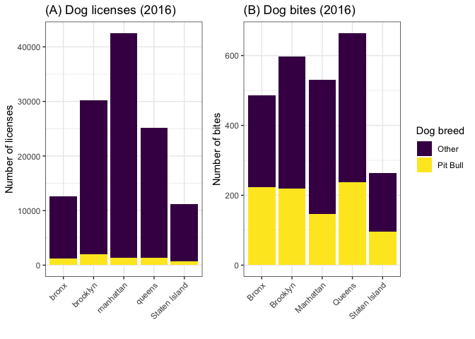

Breed standardize
================
Alyssa Vanderbeek (amv2187)

    ## Parsed with column specification:
    ## cols(
    ##   unique_id = col_integer(),
    ##   date_of_bite = col_date(format = ""),
    ##   species = col_character(),
    ##   breed = col_character(),
    ##   age = col_integer(),
    ##   gender = col_character(),
    ##   spay_neuter = col_logical(),
    ##   borough = col_character(),
    ##   zip_code = col_integer(),
    ##   pit_bull = col_logical(),
    ##   zip_match = col_logical(),
    ##   zip_code_imputed = col_integer()
    ## )

    ## Parsed with column specification:
    ## cols(
    ##   row_number = col_integer(),
    ##   breed_name = col_character(),
    ##   zip_code = col_integer(),
    ##   borough = col_character(),
    ##   cleaned_borough = col_character(),
    ##   final_borough = col_character(),
    ##   issued_year = col_integer(),
    ##   expired_year = col_integer(),
    ##   pit_bull = col_logical()
    ## )

We were interested to know how the raw counts of dog bites compared to the number of registered dogs; if there are more pit bull bites, does that mean that pit bulls are more aggressive and likely to bite than other breeds, or is it simply that there are more pit bulls in the city?

    ## [1] 0.03861740 0.01975488 0.01246853 0.02644470 0.02368563

    ## [1] 0.1792000 0.1088570 0.1064140 0.1729651 0.1378810

    ## [1] 0.023114248 0.013380531 0.009335116 0.017949690 0.016161423

Assumptions made in this analysis: - each reported bite is made by a different dog - no dog appears in the licensing dataset more than once - all dogs that bite are licensed - dogs bite only in their borough

If we assume that no dog bites twice, and all dogs that bite are licensed, then across all boroughs, 2.09% of licensed dogs bite. By borough, it breaks down as follows:

| Borough       |  No. Licenses|  No. bites|  Percent|
|:--------------|-------------:|----------:|--------:|
| manhattan     |         42507|        530|     1.25|
| brooklyn      |         30271|        598|     1.98|
| queens        |         25109|        664|     2.64|
| bronx         |         12585|        486|     3.86|
| staten island |         11146|        264|     2.37|

A higher percentage of licensed dogs bite in the Bronx than any other NYC borough; Manhattan has the lowest percentage of total dog bites. However, Manhattan has the most licensed dogs by quite a bit, whereas the Bronx has the second fewest number of registered dogs. Queens has the highest number of reported bites (664 total).

We can break this analysis down by dog breed; pit bull or not. Across all years, 32.57% of all bites are given by pitbulls; in 2016, this number was 35.74%. This is a rather high percentage for a single breed.

The figures below show the number of registered dogs and number of bites by borough, and classified by breed type. Only a small percentage of registered dogs are pitbulls (A), but upwards of 30% of all reported bites are given by pit bulls (B).

