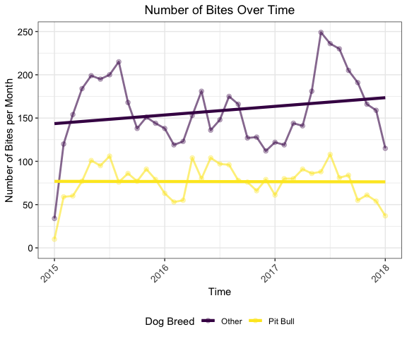
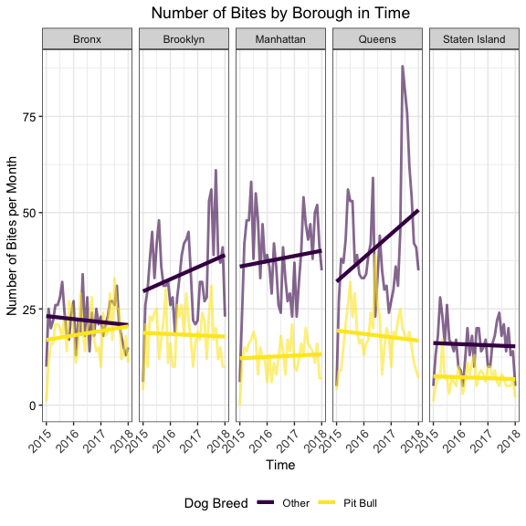

*I thought your dog did not bite!*
================
Quinton Neville (qn2119), Alyssa Vanderbeek (amv2187), Lyuou Zhang (lz2586), Zelos Zhu (zdz2101)
5 December 2018

Motivation
----------

Pit bulls have a historically poor reputation as an aggressive breed. They're most commonly used in dog fighting, and are often not permitted as pets in many leasing communities. Because of their poor reputation, thousands of pitbulls are euthanized in kill shelters each year. Supporters of the breed have championed these dogs as sweet and loving in nature, and in recent years have been pushing to change the negative stigma that surrounds them. Below are some resources that dive into these topics, from both organizations and individuals:

-   [The American Pit Bull Foundation](https://americanpitbullfoundation.com) provides resources for adoption and responsible pet ownership.
-   News organizations publish [articles](https://www.huffingtonpost.com/chris-white/myths-lies-and-misconceptions-pit-bulls_b_8072204.html) that advocate for pitbulls.
-   Social media platforms like [Facebook](https://www.facebook.com/PitBullAdvocates1/) and [Twitter](https://twitter.com/pitbulladvocate?lang=en) provide a space for advocates to come together.

The purpose of this project was to use quantitative data to assess whether pitbulls are more aggressive than other breeds. By using reporting of dog bites as a surrogate measure of aggression, can we see whether pit bulls are more aggressive than other breeds, and whether this has changed over time?

Research questions
------------------

Our research questions did not evolve much over the course of our project. Our final question broke down into the following:

-   Are there more bites by pitbulls than other breeds? Does this number vary by borough?
-   Are there more pitbulls in certain neighborhoods? How does this compare to the number of bites seen in each borough?
-   What is the relationship between dog breed, spay/neuter status, and dog bites?
-   Can we identify any trends in dog bite reports over time? Does season / weather affect the number of dog bites?

Data
----

### Data sources

All data was downloaded as .csv files from [NYC Open Data](https://opendata.cityofnewyork.us). We examine two datasets to answer our research questions:

**Dog Licensing data**: Active Dog Licenses during 2016.

All dog owners residing in NYC are required by law to license their dogs. The data is sourced from the [DOHMH Dog Licensing System](https://a816-healthpsi.nyc.gov/DogLicense), where owners can apply for and renew dog licenses. Each record represents a unique dog license that was active during the year, but not necessarily a unique record per dog, since a license that is renewed during the year results in a separate record of an active license period. Each record stands as a unique license period for the dog over the course of the yearlong time frame.

Variables provided: RowNumber, AnimalName, AnimalGender, AnimalBirthMonth, BreedName, Borough, ZipCode, CommunityDistrict, CensusTract2010, NTA, CityCouncilDistrict, CongressionalDistrict, StateSenatorialDistrict, LicenseIssuedDate, LicenseExpiredDate

**Dog Bite data** NYC Reported Dog Bites (2015 - 2018)

Information reported assists the Health Department to determine if the biting dog is healthy ten days after the person was bitten in order to avoid having the person bitten receive unnecessary rabies shots. Data is collected from reports received online, mail, fax or by phone to 311 or NYC DOHMH Animal Bite Unit. Each record represents a single dog bite incident. Information on breed, age, gender and spayed or neutered status have not been verified by DOHMH and is listed only as reported to DOHMH.

Variables provided: UniqueID, DateOfBite, Species, Breed, Age, Gender, SpayNeuter, Borough, ZipCode

**Original and cleaned datasets can be found in Google Drive [here](https://drive.google.com/drive/folders/1wZfIbv9UWAoI-YO1mwRgoXmU-ucr0inX).**

### Data cleaning

The biggest hurdle to overcome in cleaning the data was identifying the borough (Bronx, Brooklyn, Manhattan, Queens, Staten Island). There were many miscellaneous (e.g. Jersey City) or narrow (e.g. Astoria, which is part of Queens) entries, and identifying them required a bit of labor.

In the dog bite data, we had the additional challenge of verifying validity of existing zip codes and imputing zip codes where they were missing or invalid. Through some exploration, we found that about 25% of the data (~2,000 reports) had a missing or invalid zip code. We imputed on these entries by assuming that the listed borough was correct and (1) getting a full list of true zip codes by borough from the data found in the `zipcode` library; (2) matching the verifying whether the zip codes given were legitimate by cross referencing said data; and (3) imputing a zip code for missing entries based on frequencies found in the non-missing dog bite data.

The licensing data required us to clean the borough names. We did this by (1) manually obtaining a list of clearly mis-classified borough entries and recoding them properly; (2) re-assigning these mis-classifications with the larger borough, (3) matching the zip codes with those in the `zipcode` library data, (4) verify assigning final borough assignment by referencing the `zipcode` data as truth.

``` r
# list of Queens neighborhood strings found in license/dog bite datasets
queens <- c("astoria", "elmhurst", "flushing", "jackson heights", "kew gardens", "woodside", "briarwood", "corona", "forest hills", "ozone park", "richmond hill", "rockaway park", "arverne", "bayside", "belle harbor", "cambria heights", "college point", "east elmhurst", "glen oaks", "glendale", "jackson hgts", "long island city", "maspeth", "middle vilg", "middle village", "oakland gardens", "quens", "ridgewood", "so richmond", "south richmond hil", "woodside ny.", "fresh meadows", 'queens village')

# list of boroughs found in license data that are not actually in NYC
not_nyc <- c("jersey city", "albany", "bronxville", "floral park", "hoboken", "kissimmee florida", "lynbrook", "middletown", "san francisco", "santa monica", "wappingers falls, ny", "west palm beach", "the villages")

# list of staten island strings
staten_island <- c("staten is", "staten island, ny", "staten island")

# unknown / vague borough
unknown_borough <- c("new york", "new york city", "nyc", "ny", "b", "potomac", NA)


# get list of real zipcodes for each borough using the 'zipcode' library
data(zipcode) 
zipcode = zipcode %>%
  mutate(city = tolower(city),
         borough = ifelse(city %in% c('new york', 'manhattan'), 'Manhattan', NA), # recode borough
         borough = ifelse(city == 'bronx', 'Bronx', borough),
         borough = ifelse(city == 'brooklyn', 'Brooklyn', borough),
         borough = ifelse(city %in% c('queens', queens), 'Queens', borough),
         borough = ifelse(city %in% c('staten island', staten_island), 'Staten Island', borough)) %>%
  filter(borough %in% c('Manhattan', 'Bronx', 'Brooklyn', 'Queens', 'Staten Island') & state == 'NY')

# create nested data frame of zip codes by borough to impute on missing dog bite zip codes
zip_list = zipcode %>%
  select(borough, zip) %>%
  nest(-borough)


str(zip_list)
```

    ## 'data.frame':    5 obs. of  2 variables:
    ##  $ borough: chr  "Manhattan" "Staten Island" "Bronx" "Queens" ...
    ##  $ data   :List of 5
    ##   ..$ :'data.frame': 169 obs. of  1 variable:
    ##   .. ..$ zip: chr  "10001" "10002" "10003" "10005" ...
    ##   ..$ :'data.frame': 14 obs. of  1 variable:
    ##   .. ..$ zip: chr  "10301" "10302" "10303" "10304" ...
    ##   ..$ :'data.frame': 26 obs. of  1 variable:
    ##   .. ..$ zip: chr  "10451" "10452" "10453" "10454" ...
    ##   ..$ :'data.frame': 48 obs. of  1 variable:
    ##   .. ..$ zip: chr  "11004" "11101" "11102" "11103" ...
    ##   ..$ :'data.frame': 52 obs. of  1 variable:
    ##   .. ..$ zip: chr  "11201" "11202" "11203" "11204" ...

``` r
# set seed
set.seed(1)

# list of official NYC zip codes 
official.zip = paste(zipcode$zip, collapse = '|')

# dog bite data
dog_bite = read_csv('../data/DOHMH_Dog_Bite_Data.csv',
                    col_type = cols(UniqueID = col_integer(),
                        DateOfBite = col_date(format = '%B %d %Y'), # set as date variable
                        Species = col_character(),
                        Breed = col_character(),
                        Age = col_number(),
                        Gender = col_character(),
                        SpayNeuter = col_logical(),
                        Borough = col_character(),
                        ZipCode = col_character()
                      )) %>% # read data
  janitor::clean_names() %>%
  mutate(pit_bull = str_detect(tolower(breed), 'pit bull|pitbull|pit-bull')) %>% # logical column for whether dog was a pitbull breed or not
  mutate(
    zip_code = zip_code %>% 
               ifelse(str_length(.) != 5, NA, .) %>%  # set zip codes without length 5 equal to NA
               str_replace(., "O", "0") %>% # replace O's with zeros
               ifelse(str_detect(., "^[02-9]"), NA, .), # ?
    zip_match = str_detect(zip_code, official.zip), # is the given zip code valid?
    zip_code  = ifelse(zip_match == FALSE, NA, zip_code)
  ) %>%
  left_join(., # left join the nested zip codes on the dog bite data by borough
            na.omit(.) %>% 
            left_join(., count(., borough), by = "borough") %>% 
            group_by(borough, zip_code) %>%
            summarize(proportion = n()/unique(n)) %>% 
            rename(zip_list = zip_code) %>%
            nest(zip_list, proportion) %>% 
            rename(zip_nest = data),
            by = 'borough') %>% 
  mutate(
    zip_sample = map_chr(.x = zip_nest, ~sample(.x$zip_list, 1, prob = .x$proportion)), # impute zip codes where missing based on frequency with which they appear in the non-missing data
    zip_code_imputed = zip_code %>% ifelse(is.na(.), zip_sample, .)
  ) %>% 
  select(-c(zip_nest, zip_sample)) # final data frame of dog bites


str(dog_bite)
```

    ## Classes 'tbl_df', 'tbl' and 'data.frame':    8707 obs. of  12 variables:
    ##  $ unique_id       : int  8140 1 2 3 4 5 6 7 8 9 ...
    ##  $ date_of_bite    : Date, format: "2015-12-02" "2015-01-27" ...
    ##  $ species         : chr  "DOG" "DOG" "DOG" "DOG" ...
    ##  $ breed           : chr  "Pug" "Jack Russ" "Mastiff, Bull" "PIT BULL/GOLDEN RETRIVE X" ...
    ##  $ age             : num  7 11 NA NA NA NA 3 NA 4 1 ...
    ##  $ gender          : chr  "F" "M" "U" "U" ...
    ##  $ spay_neuter     : logi  TRUE FALSE FALSE FALSE FALSE FALSE ...
    ##  $ borough         : chr  "Staten Island" "Brooklyn" "Brooklyn" "Brooklyn" ...
    ##  $ zip_code        : chr  NA "11217" NA "11236" ...
    ##  $ pit_bull        : logi  FALSE FALSE FALSE TRUE FALSE TRUE ...
    ##  $ zip_match       : logi  NA TRUE NA TRUE TRUE NA ...
    ##  $ zip_code_imputed: chr  "10312" "11217" "11235" "11236" ...

**Licensing data**

``` r
# function to capitalize first letter of words
simpleCap <- function(x) {
    s <- strsplit(x, " ")[[1]]
    paste(toupper(substring(s, 1, 1)), substring(s, 2),
          sep = "", collapse = " ")
}

# clean license data
license <- read_csv("../data/NYC_Dog_Licensing_Dataset.csv") %>%
  mutate(Borough = tolower(Borough),
         LicenseIssuedDate = as.Date(LicenseIssuedDate, "%m/%d/%Y"),
         LicenseExpiredDate = as.Date(LicenseExpiredDate, "%m/%d/%Y"),
         issued_year = year(LicenseIssuedDate),
         expired_year = year(LicenseExpiredDate),
         cleaned_borough = ifelse(Borough %in% queens, "queens", Borough), # clean borough names where obvious
         cleaned_borough = ifelse(cleaned_borough %in% not_nyc, "not nyc", cleaned_borough),
         cleaned_borough = ifelse(cleaned_borough %in% staten_island, "Staten Island", cleaned_borough),
         cleaned_borough = ifelse(cleaned_borough %in% unknown_borough, "Other", cleaned_borough),
         zip = as.character(ZipCode)) %>% # recast zip code as character
  left_join(., zipcode, by = 'zip') %>% # left join the zipcode data from 'zipcode' library
  rowwise() %>%
  mutate(borough = ifelse(is.na(borough), simpleCap(cleaned_borough), simpleCap(borough))) %>% # assign borough from original license data if 
  rename(final_borough = borough) %>% # rename variable
  select(RowNumber, BreedName, ZipCode, Borough, cleaned_borough, final_borough, issued_year, expired_year) %>%
  filter(tolower(cleaned_borough) == tolower(final_borough)) %>%
  mutate(BreedName = tolower(BreedName),
         pit_bull = str_detect(BreedName, 'pit bull')) %>%
  janitor::clean_names() %>%
  filter(cleaned_borough != 'not nyc') # exclude licenses from outside NYC


str(license)
```

    ## Classes 'rowwise_df', 'tbl_df', 'tbl' and 'data.frame':  121624 obs. of  9 variables:
    ##  $ row_number     : int  1753 2415 3328 7537 8487 10503 11682 12307 12652 13839 ...
    ##  $ breed_name     : chr  "beagle" "boxer" "maltese" "pug" ...
    ##  $ zip_code       : int  11236 11210 10464 11221 10451 11225 10021 10305 11220 10468 ...
    ##  $ borough        : chr  "brooklyn" "brooklyn" "bronx" "brooklyn" ...
    ##  $ cleaned_borough: chr  "brooklyn" "brooklyn" "bronx" "brooklyn" ...
    ##  $ final_borough  : chr  "Brooklyn" "Brooklyn" "Bronx" "Brooklyn" ...
    ##  $ issued_year    : num  2014 2015 2015 2015 2015 ...
    ##  $ expired_year   : num  2016 2016 2016 2016 2016 ...
    ##  $ pit_bull       : logi  FALSE FALSE FALSE FALSE FALSE FALSE ...

Exploratory analysis
--------------------

In cross-referencing across two datasets, we had to make several assumptions in our analysis. Namely, we assumed that each bite was from a different dog, licenses are unique to individual dogs, all dogs that bite are licensed, and dog bite only in their neighborhood. We discuss these assumptions and their potential implications in the Discussion section.

``` r
# dog bite data from only 2016 to match dog licensing data
dg_2016 = dog_bite %>%
  filter(date_of_bite > '2016-01-01' & date_of_bite < '2016-12-31')
```

We were interested to know how the raw counts of dog bites compared to the number of registered dogs; if there are more pit bull bites, does that mean that pit bulls are more aggressive and likely to bite than other breeds, or is it simply that there are more pit bulls in the city?

``` r
# number of dog bites (pitbull vs. other) by boro
bite_counts = dg_2016 %>%
  group_by(borough, pit_bull) %>% # group by borough and whether the dog was a pit bull or not
  count %>% # get total counts
  ungroup %>%
  spread(key = pit_bull, value = n)  %>%
  `colnames<-`(c('boro', 'not_pitbull_bites', 'pitbull_bites')) %>%
  mutate(total_bites = `not_pitbull_bites` + `pitbull_bites`)

# number of registered dogs (pitbull vs. other) by boro
license_counts = license %>%
  group_by(final_borough, pit_bull) %>%
  count %>%
  spread(key = pit_bull, value = n) %>%
  dplyr::select(1:3) %>%
  `colnames<-`(c('boro', 'not_pitbull_lic', 'pitbull_lic')) %>%
  mutate(total_lic = `not_pitbull_lic` + `pitbull_lic`)


master = dplyr::inner_join(bite_counts, license_counts, by = 'boro') %>%
  filter(boro != 'Other')
```

If we assume that no dog bites twice, and all dogs that bite are licensed, then across all boroughs, 2.09% of licensed dogs bite. By borough, it breaks down as follows:

``` r
# print table of dog bites / licenses by borough
master %>%
  mutate('Percent' = round((total_bites / total_lic) * 100, 2)) %>%
  dplyr::select(boro, total_lic, total_bites, Percent) %>%
  arrange(-total_lic) %>%
  `colnames<-`(c('Borough', 'No. Licenses', 'No. bites', 'Percent')) %>%
  knitr::kable()
```

| Borough       |  No. Licenses|  No. bites|  Percent|
|:--------------|-------------:|----------:|--------:|
| Manhattan     |         42507|        530|     1.25|
| Brooklyn      |         30271|        598|     1.98|
| Queens        |         25109|        664|     2.64|
| Bronx         |         12585|        486|     3.86|
| Staten Island |         11146|        264|     2.37|

A higher percentage of licensed dogs bite in the Bronx than any other NYC borough; Manhattan has the lowest percentage of total dog bites. However, Manhattan has the most licensed dogs by quite a bit, whereas the Bronx has the second fewest number of registered dogs. Queens has the highest number of reported bites (664 total).

We can break this analysis down by dog breed; pit bull or not. Across all years, only 5.52% of registered dogs are pitbulls. However, 32.57% of all bites are given by pitbulls; in 2016, this number was 35.74%.

The figures below show the number of registered dogs and number of bites by borough, and classified by breed type. The overall trend described above is upheld. A small percentage of licensed dogs are pit bulls (A), but upwards of 30% of all reported bites are given by pit bulls (B).

``` r
# number of licenses in each borough in 2016 by breed type
lic_bar = license %>%
  filter(final_borough != 'Other') %>% # remove unknown borough
  ggplot(aes(x = final_borough, fill = pit_bull)) +
  geom_bar() +  # bar plot
  viridis::scale_fill_viridis( # color scheme
    name = 'Dog breed',
    labels = c('Other', 'Pit Bull'),
    discrete = T
  ) + 
  theme(legend.position = 'bottom') + 
  labs(title = '(A) Dog licenses (2016)',
       x = '',
       y = 'Number of licenses')

# number of dog bites in each borough by breed type
bite_bar_2016 = dg_2016 %>%
  filter(borough != 'Other') %>%
  ggplot(aes(x = borough, fill = pit_bull)) +
  geom_bar() + 
  viridis::scale_fill_viridis(
    name = 'Dog breed',
    labels = c('Other', 'Pit Bull'),
    discrete = T
  ) + 
  labs(title = '(B) Dog bites (2016)',
       x = '',
       y = 'Number of bites') +
  theme(legend.position = 'right')


# print figures
lic_bar + theme(legend.position = 'none',
                axis.text.x = element_text(angle = 45, hjust = 1)) + bite_bar_2016 + theme(axis.text.x = element_text(angle = 45, hjust = 1))
```


**Are pitbulls spayed/neutered more often than other breeds?**

Male dogs appear to bite more often than their female counterparts - more than twice as much. Among dogs whose gender is known, non-spayed/neutered dogs bite slightly less than their fixed counterparts. Interestingly, this relationship is flipped for pit bulls. Unfixed pit bulls bite more than fixed pit bulls regardless of gender, and this effect is much more pronounced in males than females.

We wonder if there may be misclassification error associated with the spaying status of female dogs since it is easier to physically see whether or not a male dog is neutered. The "eye test" of spaying status for female dogs is not quite as easy to do.

With that said, it is especially worth noting that we have a handful of dogs whose gender is unknown, which brings up the integrity of their spayed/neutered status since it seems almost all dogs of unknown gender were coded to be not spayed/neutered. It may be that the truth underlying this data coding would result in a diffierent conclusion.

``` r
dog_bite %>%
  group_by(gender, spay_neuter, pit_bull) %>%
  count() %>% # counts of spay/neuter status by sex and breed type
  group_by(pit_bull) %>%
  mutate(gender = recode(gender, 'F' = 'Female', 'M' = 'Male', 'U' = 'Unknown'), # recode gender variable
         spay_neuter = ifelse(spay_neuter == TRUE, "Yes", "No")) %>% # recode spay/neuter status
  ggplot(aes(x = spay_neuter, y = n, fill = pit_bull)) + 
  geom_bar(stat = "identity",  position = "stack") + 
  #geom_text(aes(label = n), position = position_stack(vjust = 0.5)) + 
  #scale_fill_manual(values = c('#FFF8DC','#9370DB')) + 
  labs(y = "Number of Bites",
       x = "Spayed/Neutered Status") +
  #theme_hc() + 
  facet_grid(~ gender) + 
  viridis::scale_fill_viridis(
    name = 'Dog breed',
    labels = c('Other', 'Pit Bull'),
    discrete = T
  )
```


**Are time and location associated with dog bite incidents?**

With respect to the temporal dynamics of pit bull versus non-pit bull bites, from the beginning of 2015 through the end of 2017, we observed a moderate overall increase in the mean number of bites per month by non-pitbulls. However, for pit bulls, the trend in number of bites per month is more stable, portraying a slight decrease in the mean number of bites in time.

``` r
 time.overall.df <- dog_bite %>%
  mutate(date = ymd(date_of_bite)) %>% 
  mutate_at(vars(date), funs(year, month, day)) %>%
  mutate(date_numeric = lubridate::decimal_date(date)) %>%
  select(-date) %>% 
  mutate(borough = as.factor(borough)) %>% 
  group_by(year, month) %>%
  summarise(
    pitbull    = sum(pit_bull),
    no_pitbull = sum(!(pit_bull))
  ) %>% ungroup() %>%
  gather(key = pit_bull, value = num_bites, pitbull:no_pitbull) %>%
  mutate(
    pit_bull = ifelse(pit_bull == "pitbull", "Pit Bull", "Other") %>% as.factor(),
#    pit_bull = fct_relevel(pit_bull, "Yes"),
    date_numeric = year + (month - 1)/12
  )


time.overall.plot <- time.overall.df %>%
 ggplot(aes(x = date_numeric, y = num_bites, colour = pit_bull)) + 
  geom_point(alpha = 0.3, size = 2) + 
  geom_line(size = 1, alpha = 0.6) + 
  geom_smooth(aes(colour = pit_bull), size = 1.5, alpha = 0.5, se = F, method = "lm") + 
    theme(legend.position = "bottom",
        axis.text.y = element_text(color = "black", 
                                   size = 10,  hjust = 1), 
        axis.text.x = element_text(angle = 45, 
                                   hjust = 1, size = 10)) +
  labs(
    x = "Time",
    y = "Number of Bites per Month",
    title = "Number of Bites Over Time"
  ) + 
    viridis::scale_colour_viridis(
    name = "Dog Breed", 
    discrete = TRUE
   ) +
  xlim(c(2015, 2018)) 

time.overall.plot
```



Additionally, we observed an oscillating fluctation in seasonal effects, with overall dog bites rising during the summer months and falling during the winter months.

Next, we considered the borough level effects on the temporal patterns of dog bites.

``` r
#Create Bites Per Month Data Frame, by Borough
time.boro.df <- dog_bite %>%
  mutate(date = ymd(date_of_bite)) %>% 
  mutate_at(vars(date), funs(year, month, day)) %>%
  select(-date) %>% 
  mutate(borough = as.factor(borough)) %>% group_by(year, month, borough) %>%
  summarise(
    pitbull    = sum(pit_bull),
    no_pitbull = sum(!(pit_bull))
  ) %>% ungroup() %>%
  gather(key = pit_bull, value = num_bites, pitbull:no_pitbull) %>%
  mutate(
    pit_bull = ifelse(pit_bull == "pitbull", "Pit Bull", "Other") %>% as.factor(),
    date_numeric = year + (month - 1)/12
  )

#Lineplot of Bites per Month by Borough
time.boro.plot <- time.boro.df %>%
  filter(borough != "Other") %>%
  ggplot(aes(x = date_numeric, y = num_bites, colour = pit_bull)) + 
  geom_line(size = 1, alpha = 0.6) + 
  geom_smooth(aes(colour = pit_bull), size = 1.5, alpha = 0.3, se = F, method = "lm") + 
  theme(legend.position = "bottom",
        axis.text.y = element_text(color = "black", 
                                   size = 10,  hjust = 1), 
        axis.text.x = element_text(angle = 45, 
                                   hjust = 1, size = 10)) +
  labs(
    x = "Time",
    y = "Number of Bites per Month",
    title = "Number of Bites by Borough in Time"
  ) + 
  viridis::scale_colour_viridis(
    name = "Dog Breed", 
    discrete = TRUE
   ) +
  xlim(c(2015, 2018)) +
  facet_grid(~borough)

time.boro.plot
```



In Manhattan, we see the largest mean difference in pit bull vs. non-pit bull bites per month; trends over time are similar between breed types. Conversely, a smaller mean difference between breeds was observed in Staten Island, with a nearly identical trends over time. Brooklyn and Queens both demonstrate a widening gap over time, with the pit bull bites decreasing and non-pit bull bites increasing notably. Interestingly, there is an inverse trend between pit bulls and other breeds; pit bull bites increase over time while non-pit bull bites decreased.

**Exploration of geographical distribution of dog bites**

We decided to look at visualizations of the geographical distribution of dog bites across the five boroughs. Fortunately, we were able to do so by making use of the `leaflet` library, and produced interactive plots. Screenshots of these maps are given below, with the fully rendered versions available on our [website.](https://nevilleq.github.io/p8105_fp_qzal/) The purpose of this exploration was not to test any hypotheses, but to provide us and our readers with an interactive tool to explore our data. The trends we see in the geography match the exploratory analysis we conducted up to this point For example, as we saw in a previous section, there is a higher concentration of pit bull bites in the Bronx compared to other boroughs, in relation to the total number of dog bites. Interestingly, the places with more bites overall also had the most pit bull bites as well; the distribution of bites by breed is consistent across location.


``` r
# Code for rendering leaflet maps

# count the number of dog bite incidence by zip code
bite_count <- dog_bite %>%
  group_by(zip_code_imputed) %>%
  summarize(n_bite = n())

# for pit bulls
pit_bite <- dog_bite %>%
  filter(
   str_detect(breed, '[pP][iI][Tt].[Bb][Uu][Ll][Ll]')
  ) %>%
  group_by(zip_code_imputed) %>%
  summarize(
    n_pit = n()
  )

# zip code tabulation area
# https://data.cityofnewyork.us/Business/Zip-Code-Boundaries/i8iw-xf4u/data
# import the shape file
# https://plotly-book.cpsievert.me/maps.html

zip_map <- readOGR(dsn = './data/ZIP_CODE_040114/ZIP_CODE_040114.shp', encoding = "UTF-8")

zip_map@data <- left_join(zip_map@data, bite_count, by = c('ZIPCODE' = 'zip_code_imputed'))

zip_map@data <- left_join(zip_map@data, pit_bite, by = c('ZIPCODE' = 'zip_code_imputed'))

# assign 0 for zip codes that have no match in the dog bite data
zip_map$n_bite[is.na(zip_map$n_bite)] <- 0
zip_map$n_pit[is.na(zip_map$n_pit)] <- 0

# CRS setting
zip_map_crs <- spTransform(zip_map, CRS("+init=epsg:4326"))

# export the json file
# writeOGR(zip_map_crs, './data/zip_map_geojson', layer = 'zip_map', driver = 'GeoJSON')

# Layout
# format of the label that pops up for each polygon
label_popup <- paste0(
  "<strong>Zip code: </strong>",
  zip_map$ZIPCODE,
  "<br><strong>Number of dog bites: </strong>",
  zip_map$n_bite
)

# format of the label for each polygon: pit bull bites
label_popup_pit <- paste0(
  "<strong>Zip code: </strong>",
  zip_map$ZIPCODE,
  "<br><strong>Number of dog bites: </strong>",
  zip_map$n_pit
)

# get jenks natural break for dog bites
getJenksBreaks(zip_map$n_bite, 6)

# get jenks natural breaks for pit bull bites
getJenksBreaks(zip_map$n_pit, 6)

# set bins
bite_bins <- c(0, 25, 62, 97, 141, 260)
pit_bins <- c(0 , 4, 14, 25, 41, 80)

# set pals
bite_pal <- colorBin('Greens', bins = bite_bins, na.color = '#aaff56')
pit_pal <- colorBin('Greens', bins = pit_bins, na.color = '#aaff56')

## Number of dog bites by zip code

# choropleth map for dog bites
leaflet::leaflet(data = zip_map_crs) %>%
  addProviderTiles('CartoDB.Positron') %>%
  addPolygons(fillColor = ~bite_pal(n_bite),
              fillOpacity = 0.8,
              color = "#BDBDC3",
              weight = 1,
              popup = label_popup,
              highlightOptions = highlightOptions(color = "black", weight = 2,
      bringToFront = TRUE)) %>%
  addLegend('bottomleft',
            pal = bite_pal,
            values = ~n_bite,
            title = 'Number of dog bite incidents by zip code',
            opacity = 1)

## Number of pit bull bites by zip code
# choropleth map for pit bull bites
leaflet::leaflet(data = zip_map_crs) %>%
  addProviderTiles('CartoDB.Positron') %>%
  addPolygons(fillColor = ~pit_pal(n_pit),
              fillOpacity = 0.8,
              color = "#BDBDC3",
              weight = 1,
              popup = label_popup_pit,
              highlightOptions = highlightOptions(color = "black", weight = 2,
      bringToFront = TRUE)) %>%
  addLegend('bottomleft',
            pal = pit_pal,
            values = ~n_pit,
            title = 'Number of pit bull bite incidents by zip code',
            opacity = 1)


#https://gist.github.com/brianhigh/2efe4d0bedf0eebe70cbcd58f2b894f7
```

Additional Analysis
-------------------

After visually inspecting the temporal dynamics of pit bull bites in time, we sought to formally test the hypothesis that the number of given pit bull dog bites decreased from 2015-2018 in NYC. The purpose of this analysis was not to formally predict the number of bites, but rather to see whether there was a significant change in the expected number of dog bites over time, adjusting for breed, seasonal, and borough-level effects. We initially tried to fit a logistic regression to model the odds of being bitten by a pit bull versus another breed, but found the interpretation of this model difficult in accounting for the temporal component. We also fit a Poisson regression, which confirmed the interpretation in our final model below. Ultimately we opted for multiple linear regression, since the logit and Poisson model assumptions were violated. Our final linear model took the form


for month *i*.

``` r
#Data Frame for linear modeling
#Center time at 2015, borough factor, seasonal factor, filter 2015-2018
#Modeling with data grouped by month
lm.df <- time.boro.df %>%
  mutate(date_numeric = date_numeric - 2015,
         season = ifelse(month %in% c(12, 1, 2), "Winter", 
                         ifelse(month %in% c(3, 4, 5), "Spring", 
                                ifelse(month %in% c(6, 7, 8), "Summer",
                                       "Fall"))),
         season = as.factor(season),
         season = fct_relevel(season, "Winter", "Spring", "Summer", "Fall")) %>%
  rename(time = date_numeric,
         number_bites = num_bites) %>%
  filter(time >= 0 & borough != "Other")

#Full Model
lm.full <- lm(number_bites ~ time + pit_bull + pit_bull:time + season + borough, data = lm.df)

#Display
lm.full %>% 
  broom::tidy() %>%
  select(term, estimate, p.value) %>%
  knitr::kable(digits = 3)
```

| term                   |  estimate|  p.value|
|:-----------------------|---------:|--------:|
| (Intercept)            |    19.237|    0.000|
| time                   |     2.038|    0.005|
| pit\_bullPit Bull      |   -12.423|    0.000|
| seasonSpring           |     6.886|    0.000|
| seasonSummer           |    11.016|    0.000|
| seasonFall             |     5.490|    0.000|
| boroughBrooklyn        |     5.946|    0.000|
| boroughManhattan       |     5.041|    0.000|
| boroughQueens          |     9.392|    0.000|
| boroughStaten Island   |    -8.919|    0.000|
| time:pit\_bullPit Bull |    -1.912|    0.059|

After adjusting for season and borough, we see an almost negligible increase in the expected number of pit bull bites for a given month (increase of 0.126 bites per additional month). Our final regression results describe a baseline mean number of bites of 19.24 in the Bronx, in the winter, for non-pit bulls - from here there is a moderate expected mean increase in bites per month overall (2.03 bites). This estimate changes based on the borough, season, and breed.

### Checking model assumptions

Considering the assumptions for inference in our linear model, there is moderate deviance from normality in the upper tail of the Q-Q plot and a slight curvilinear trend in the residuals vs. fitted plot, but nothing too terrible. However, there are some outlying high count observations and the residuals vs. leverage plot (along with normality) are the most concerning barrier for inference.


Discussion
----------

Quantifying dog aggression with individual-reported dog bite data in NYC provides insights into trends across breeds, locations, and over time. It was interesting to note that pit bulls account for such a high percentage of reported dog bites. It begs the question: why? Is this because pit bulls bite people more often, or is it a matter of people being more inclined to report bites by pit bulls versus other breeds? Unfortunately, this is something we can't answer. Still, we found that pit bull bites increased over time at a much lower rate - almost not at all- compared to bites from other breeds. If this is a facet of reporting, then it may be that efforts to change the stigma surrounding pit bulls is working, and people are reporting such bites less often.

Cross-referencing dog bite reports with dog licenses across the five boroughs helped put the data into context - it was particularly interesting to note not only that pit bulls accounted for a third of all reported bites, but that they do so while representing &lt;6% of all licensed dogs in NYC. Patterns across spay/neuter status are also notable. We found it surprising that for all dog breeds there was a negligible difference in number of bites between fixed and unfixed dogs, but for pit bulls alone, unfixed dogs bite more often. We expected to see that unfixed dogs bite more often across all breeds.

To see that the number of dog bites increased over the several years spanned by the data was not a significant result; it could be a simple matter of reporting bias. That is, after the data resource was established in 2015 and gained recognition in the population, people reported more oftern. But it was cool to see the seasonal trends so clearly in the figures. And it makes sense for there to be more bites during warmer months, since people are more likely to be outside.

**Limitations**

The limitations of this dataset make inference difficult. The opt-in data collection makes for potentially biased data. It may be that not all bites are reported, and this underreporting could have implications for the results. For example, people could be more likely to report bites by larger versus smaller dogs, in which case pit bulls may not account for as many bites in reality as we see here. In terms of the data available, dog sex was largely unknown, calling into question the meaningfulness of our conclusions regarding the associations between dog bites and gender. Despite this, we think our findings are interesting, and at the very least prompt further investigation regarding pit bull behavior and stigma.

It's also worth noting that the assumptions we made for the purpose of our analyses may not hold to be true. To reiterate, we assumed that each bite was from a different dog, licenses are unique to individual dogs, all dogs that bite are licensed, and dog bite only in their neighborhood. It's not unreasonable to think that an unlicensed dog could bite someone, or that a dog licensed in Queens could bite someone in Brooklyn. Without additional information, it's difficult to say how these assumption violations would change the results we see. One option would be to conduct simulations, but again these would have to rely on assumptions about what percentage of bites happen outside a dog's home neightborhood, which borough a dog would be likely to bite someone outside of their own, etc.
